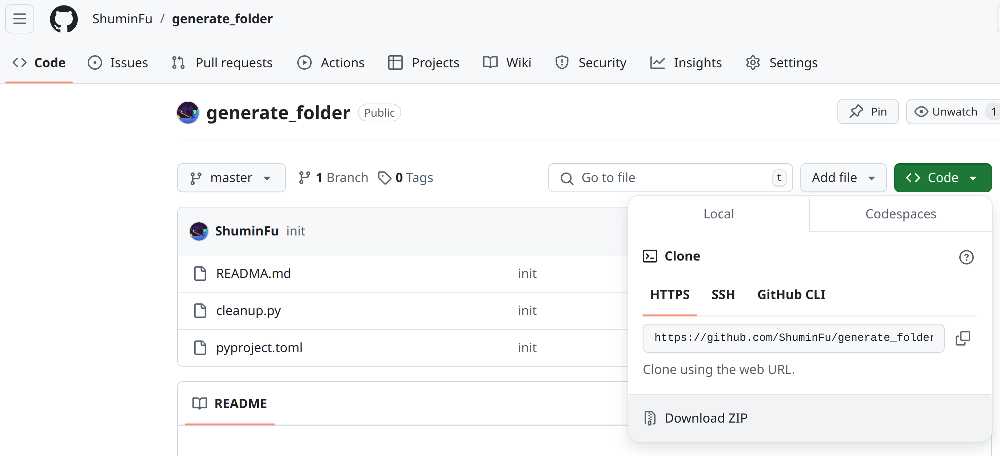
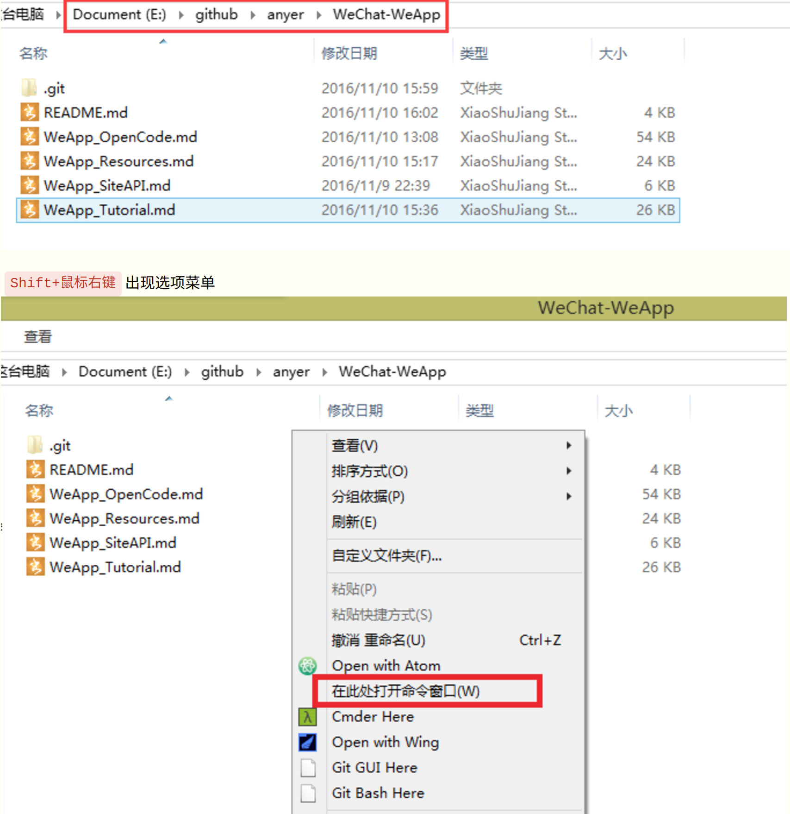

# 安装 Python

要通过 Microsoft Store 安装 Python：

1. 转到开始菜单（左下角的 Windows 图标），输入“Microsoft Store”，选择链接以打开商店。

2. 商店打开后，从右上角的菜单中选择搜索并输入“Python”。从应用程序下的结果中选择您想使用的 Python 版本。我们建议使用最新版本，除非您有其他原因（例如与您计划使用的现有项目的版本保持一致）。确定要安装的版本后，选择“获取”。

3. 一旦 Python 完成下载和安装过程，使用开始菜单（左下角的 Windows 图标）打开 Windows PowerShell。PowerShell 打开后，输入 `python --version` 以确认 Python3 已安装在您的计算机上。

4. Microsoft Store 安装的 Python 包含标准包管理器 pip。Pip 允许您安装和管理不属于 Python 标准库的附加包。要确认您也可以使用 pip 安装和管理包，请输入 `pip --version`。

# 手动获取代码

下载完代码之后进入到代码目录下，打开命令行工具PowerShell/ CMD，输入以下命令升级pip
```shell
pip install --upgrade pip
```

输入以下命令安装依赖包
```shell
pip install tkinterdnd2 -i https://mirrors.cloud.tencent.com/pypi/simple
```

# 运行代码
在代码目录下打开命令行工具PowerShell / CMD


输入以下命令运行代码
```shell
python cleanup.py
```

# Pyinstaller 打包
```shell
pyinstaller cleanup.spec
```